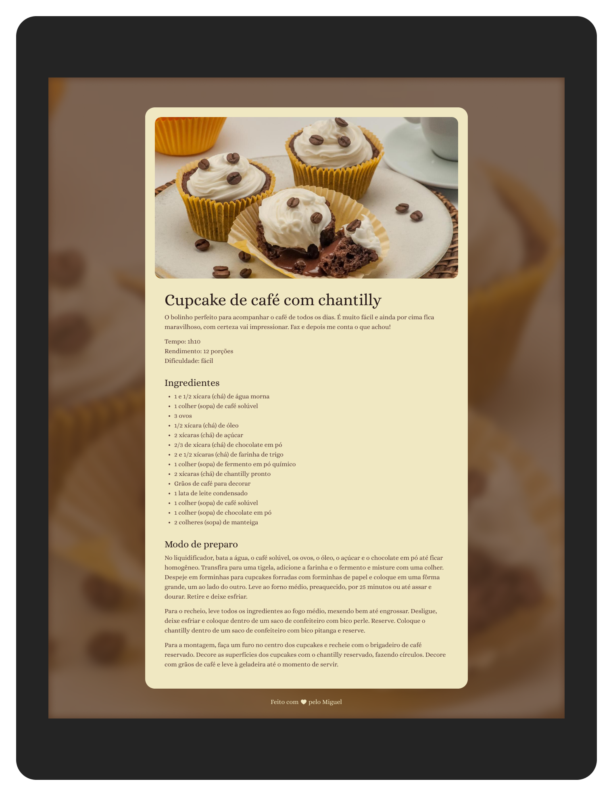

<h1 align = "center"> RECIPE </h1>

  Exclusive Program for Studying Web Technologies

  <a href = "#project"> PROJECT </a> &nbsp;&nbsp;&nbsp;|&nbsp;&nbsp;&nbsp;
  <a href = "#technologies"> TECHNOLOGIES </a> &nbsp;&nbsp;&nbsp;|&nbsp;&nbsp;&nbsp;
  <a href = "#license"> LICENSE </a>

  

 

  

## 💻  PROJECT

The "RECIPE" project is a page with a cupcake recipe.

- [PROJECT ONLINE](https://miguelcrwz.github.io/recipe)

## 🌐  TECHNOLOGIES

This project was developed using the following technologies:

- Figma
- HTML and CSS
- Git and Github

## ⚖️  LICENSE

This project is licensed under the MIT License.

---

Made with ♥ by Miguel
